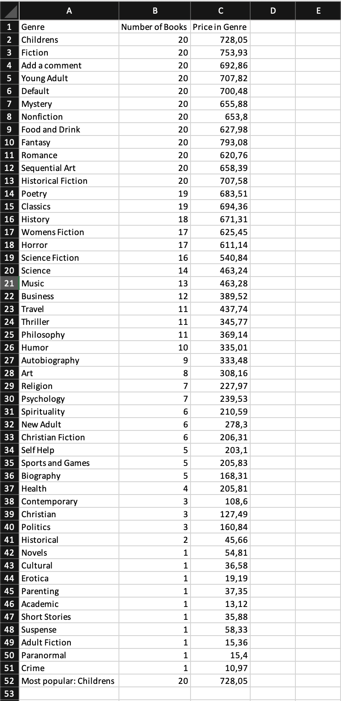

# Book Store Web Scraper Project

A simple web scraper built to scrape "https://books.toscrape.com/" and output the information that we are looking for, into a neat excel document. This was compiled by making use of python as well as some additioonal libraries such as pandas as BeautifulSoup.

---

## Expected Output



---

## Features
* Reads data from a live website 
* It counts how many books there are in a genre and appends a list
* It writes out the information into an excel document in descending order based on the amount of books

---

## Project Structure

```
bookstore_scrape/
│── main.py          
|── output_data.xlsx
|── requirements.txt
|── results.png
```

---

## Installation

1. Clone the repository:

```bash
git clone https://github.com/Jadi404/bookstore_scrape.git

```

2. Navigate to the repo:

```bash
cd bookstore_scrape
```

3. Install dependencies:

```bash
pip install -r requirements.txt
```

---

## How to Run: 

Run the script with python:

```bash
python main.py
```

---

## What I learned

* How to scrape data from structured web pages (identifying components of html)
* Exporting data into excel for reporting and easily digestible information
* Manipulating and transforming datasets making use of pandas
* Learnt more about legal guidelines and scraping websites ethically

---

## 📈 Future Improvements

* Add error handling and logging for more robust scraping
* Support multiple pages / pagination scraping
* Store data in a dedicated database instead of Excel
* Improve data cleaning and validation steps

---


## 📜 License

This project is licensed under the MIT License.

